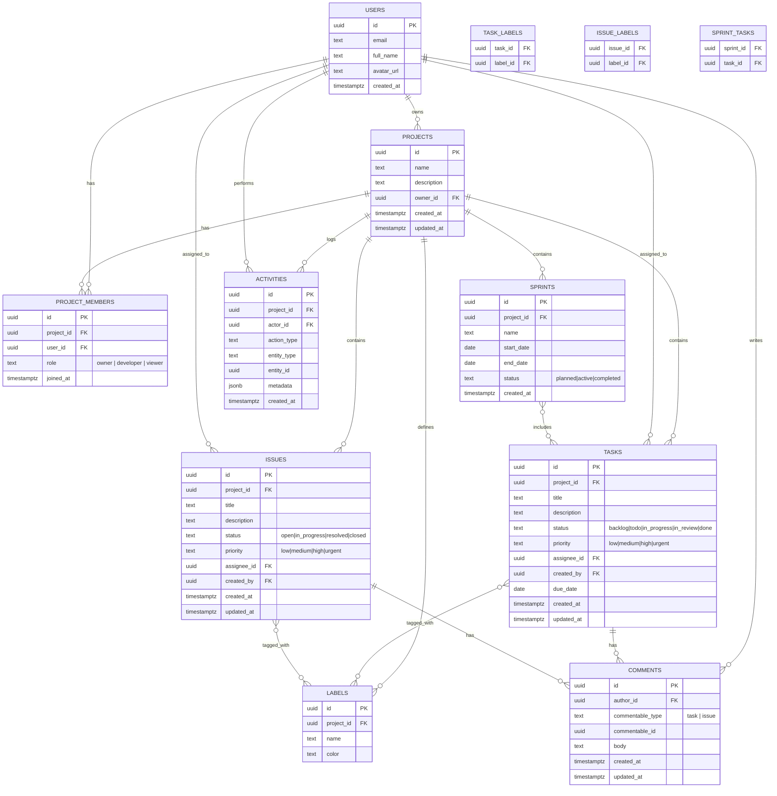

# DevFlow — Database Design

## Stack

Supabase Postgres. `auth.users` (managed by Supabase Auth) holds credentials; a `public.users` table mirrors the profile fields the app needs, kept in sync via a trigger on `auth.users` insert.

## ERD

## Table notes

**users** — `id` matches `auth.users.id` (1:1). Populated by a Postgres trigger (`handle_new_user`) on signup so the app never writes directly to `auth.users`.

**project_members** — join table carrying `role`. Unique constraint on `(project_id, user_id)`. This table is the single source of truth for authorization — every permission check joins through it.

**tasks / issues** — kept as separate tables rather than a shared `polymorphic type` table. They have different lifecycles (issues get post-MVP fields like resolution notes later) and separate tables keep queries and RLS policies simpler, at the cost of some duplication between the two.

**comments** — polymorphic via `commentable_type` + `commentable_id` rather than two separate comment tables, since comments behave identically on tasks and issues and a shared activity/notification pipeline benefits from one table. Enforce referential integrity at the application layer (Postgres can't FK a polymorphic column) and add a `CHECK` constraint on `commentable_type`.

**activities** — append-only audit log. `metadata` (jsonb) holds action-specific detail (e.g. `{"from_status": "todo", "to_status": "in_progress"}`) so the schema doesn't need to change as new activity types are added.

**sprint_tasks** — join table; a task can only belong to one _active_ sprint at a time (enforced at the application layer, not the DB, since "active" depends on sprint status).

## Row-Level Security (defense in depth)

The PRD is explicit: _"Never rely on the frontend alone to enforce permissions."_ The API layer (Route Handlers / Server Actions) is the primary enforcement point — every write checks `project_members.role` before touching data. RLS policies are added as a second, independent layer directly in Postgres, so a bug in the API layer doesn't expose data:

- `projects`: `SELECT` allowed to members of the project; `UPDATE`/`DELETE` restricted to `role = 'owner'`.
- `tasks`, `issues`, `comments`: `SELECT` allowed to project members; `INSERT`/`UPDATE` restricted to `role IN ('owner', 'developer')`.
- `activities`: `INSERT` only via a `SECURITY DEFINER` function (never direct client insert, so the log can't be forged); `SELECT` allowed to project members.

## Indexes worth adding early

- `project_members(project_id, user_id)` — unique, and the hot path for every authorization check.
- `tasks(project_id, status)` — Kanban board query.
- `tasks(assignee_id)` — "my tasks" dashboard query.
- `activities(project_id, created_at DESC)` — activity feed pagination.
